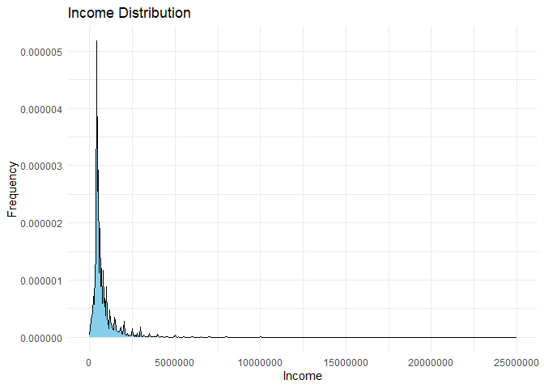
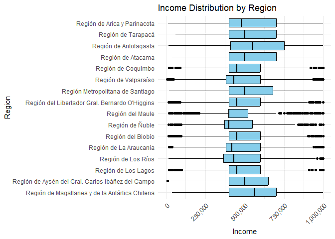
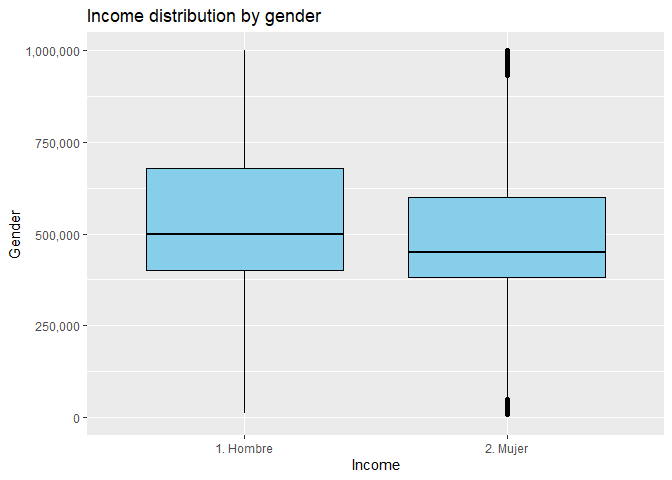
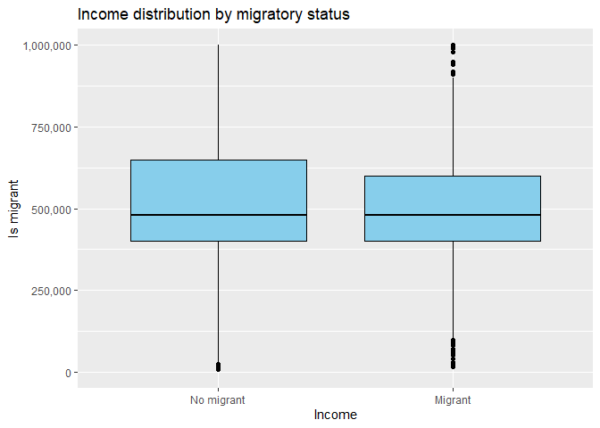

# Income prediction in Chile

Chile is a country known for its significant economic and social
diversity. Understanding how people’s incomes change is of great
interest, both on a personal and societal level. The income individuals
anticipate when moving to a new country is a highly relevant aspect in
the context of expatriation and migration. The Casen survey, combined
with machine learning tools, enables the study of this phenomenon.

**Project Overview:**

The aim of this project is to utilize the data from the CASEN Survey to
apply and compare income prediction models in Chile. The ultimate goal
is to identify the model that most accurately categorizes the income
individuals should anticipate based on their personal characteristics

**Key Objectives:**

-   **Data Exploration & Feature Engineering :** We begin by data
    exploration, aiming to understand the structure and functioning of
    the information. Subsequently, we investigate the variables of
    interest concerning the target variable, which is individuals’ work
    income. These data are prepared and made ready for modeling.

-   **Machine Learning:** For this project, a range of machine learning
    models is employed to estimate income. It start with a linear
    regression, providing essential insights to comprehend the
    relationships between variables. Subsequently, the necessary
    techniques are implemented.

-   **Evaluation and Insights:** We assess the models to identify the
    optimal one that fulfills the project’s objectives

**Key Findings:**

It was identified that income is highly correlated with years of
education and influenced by the region of residence, gender, and
migration status. Furthermore, the inherent income distribution
characteristics lead to prefer the classification of individuals’ income
into quintiles rather than a numeric prediction. Thus, the models were
compared based on their ability to correctly classify individuals. The
implementation of random forest, SVM, neural network, XGBoost, Naive
Bayes, k-NN, and linear regression was compared, with random forest
exhibiting the most favorable characteristics in terms of both accuracy
and overall approximation to individuals’ income quintiles

## Income in Chile

The Casen Survey, short for “National Socioeconomic Characterization,”
is a periodic socioeconomic study conducted in Chile by the Ministry of
Social Development and Family. It aims to collect relevant information
on the economic and social situation of the Chilean population.

The CASEN recovered data of 202,231 people from all the regions of Chile
(1% of the population of 19,828,563), from which 58,240 had some kind of
remuneration in the last month. this subset is our target population. to
understand them, lest see some basic statistics:

    The mean income in Chile is: 786,449 Chilean Pesos

    The median income in Chile is: 500,000 Chilean Pesos

    The income`s standard deviation in Chile is: 800,122 Chilean Pesos 

    The quantiles are the following:
    The quantiles are the following:

         25%      50%      75%      90%      95%      99%    99.9%   99.99% 
      400000   500000   750000  1200000  1800000  3200000  7000000 12000000 
        100% 
    25000000 

Since the mean income in Chile is greater than the median, we can imply
that the distribution is skewed to the right. this, as well as the
percentiles show us that income explodes in the higher quantiles.

Let’s examine the distribution:

Not only the distribution is very skewed to the right, but also the data
is very concentrated in the lower quantiles. this is a problem because
the model will be biased to predict low incomes. lets see the
distribution of the income by region, from north to south:

(for a geographical reference, see [this interactive
map](https://rawcdn.githack.com/RubenVasquezArr/Income_in_Chile/f2ce5a200daf63579d3ddd452435a829ef16aecb/Chile_income_map.html)
)

As can be observed, there is also great regional variation, with the El
Maule and El Ñuble regions being the poorest, while regions in close
proximity to the mining industry, located in the northern part of the
country, near the Antofagasta region, exhibit the highest incomes.
Finally, let’s examine other variables that may be related to income:

    ## Warning: Removed 1138846 rows containing non-finite values (`stat_boxplot()`).
    ## Removed 1138846 rows containing non-finite values (`stat_boxplot()`).

We can observe that there is enough variability to regard both gender
and migratory status as significant indicators of income. This
highlights the social reality of the country, where macro-level data
distinctly portray these differences.

Before diving into model analysis, we prepared the dataset by performing
data cleaning, feature engineering, and feature selection. The process
can be fount in the scripts
[casen_2022_processing](./src/features/casen_2022_processing.R) and
[casen_2022_variable_selection](./src/features/casen_2022_variable_selection.R)

## Model Analysis

After the variable preparation and selection, it is now time for the
model analysis. To accomplish this, a selection of potential
classification models was made, and they were applied using the mlr3
library, which offers a wide range of options for applying various
models, along with pre and post-analysis tools. Following the
application, measures were determined to identify the best model in this
particular case

### Model Selection

We considered a range of machine learning models, Each can be found in
this list

Regression: -[Linear
regression](./src/models/casen_2022_linear_regression.R)

Classification: -[Suport vector
machine](./src/models/casen_2022_suport_vector_machine.R) -[Single layer
neural network](./src/models/casen_2022_single_layer_neural_network.R)
-[random forest](./src/models/casen_2022_random_forest.R) -[naive
bayes](./src/models/casen_2022_naive_bayes.R) -[K-nearest
neighbors](./src/models/casen_2022_K_nearest_neighbor.R) -[extreme
gradient boosting](./src/models/casen_2022_extreme_gradient_boosting.R)

Due to prior
[experiences](https://usach.primo.exlibrisgroup.com/permalink/56USACH_INST/172ual0/alma992065340806116),
as well as the presence of skewness, outliers, and the nature of the
variables used in this task, the models are susceptible to overfitting
or showing a bias towards median values. In order to mitigate these
issues, the income has been categorized into quintiles, and the models
were trained to classify the quintile rather than predict the specific
numerical income. A better aproach would be to use deciles, but the
capacity of the machine used for this task was not enough to train the
models with this level of granularity.

### Model Measures

When applying each model, the data was divided into training (67%) and
testing (33%) subsets, with evaluations consistently performed on the
test subset. To assess the effectiveness of income classification, the
following metrics were identified:

\-**Accuracy:** A measure of how many correct predictions the model made
compared to the total number of predictions -**Mean Squared Error
(MSE):** A metric that calculates the average of the squared differences
between predicted and actual values. This metric is commonly used in
numerical prediction, but it can also be used in [ordinal
classification](https://link.springer.com/chapter/10.1007/978-3-642-01818-3_25)
to better represent the closeness of the predicted value to the actual
value, punishing more for larger differences. -**Mean Absolute Error
(MAE):**: a more digestible metric that represent the differences
between predicted and actual values. -**Training Time (seconds):** The
time it takes to train the model. -**Prediction Time (seconds):** The
time it takes to predict the test subset.

## Model Comparison

The resulting measures of the models can be found in the following
table:

| Model          | Accuracy | MSE  | MAE  | Train time (s) | Prediction time (s) |
|:---------------|:--------:|:----:|:----:|:--------------:|:-------------------:|
| Random Forest  |   0.46   | 1.18 | 0.72 |      12.3      |         3.1         |
| SVM            |   0.46   | 1.20 | 0.73 |     558.8      |        72.7         |
| Neural network |   0.43   | 1.49 | 0.83 |      6.7       |         0.1         |
| XGboost        |   0.45   | 1.29 | 0.77 |      0.3       |         0.1         |
| Naive bayes    |   0.43   | 1.43 | 0.81 |      0.0       |         2.6         |
| KNN            |   0.40   | 1.53 | 0.87 |      0.0       |         9.1         |
| Regression     |   0.38   | 1.31 | 0.83 |      0.1       |         0.0         |

The results show that the random forest model is the best performing
model, with the highest accuracy, lowest MSE, and lowest MAE. The SVM
model also performed well, with the second-highest accuracy,
second-lowest MSE, and second-lowest MAE but huge train time. Overall,
between the best and worst model, there is a 0.08 difference in accuracy
(21% improvement), 0.35 difference in MSE (22%), and 0.15 difference in
MAE (17%). This shows that the models are different in performance, but
not in a drastic way. The random forest model is the best option for
this task under the measures in consideration, being able to predict the
income quintile with an accuracy of 0.46 (compared to 0.2 of a random
guess), and mae of 0.72, meaning that the predicted quintile is on
average 0.72 quintiles away from the actual quintile.

Thank you for reading this far!, I hope you found this useful. If you
have any questions, please contact me at <Ruben.vasqueza@usach.cl>
