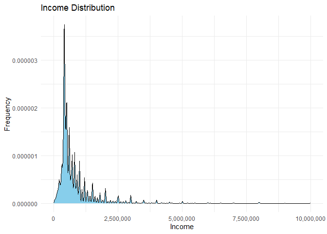

[Custom foo description](#income-in-chile)

## Income prediction in Chile

In an ever-evolving world of data science and analytics, understanding
and predicting income trends is crucial for economic and social policy
development. This GitHub project offers a comprehensive exploration of
income prediction for individuals working in Chile, utilizing data from
the CASEN (Encuesta de Caracterización Socioeconómica Nacional) survey.

**Project Overview:**

Chile’s CASEN survey is a valuable source of socioeconomic data,
capturing a wide array of information about its population. This project
delves into the realm of data science to harness this dataset’s
potential and provide insightful predictions on income levels for
individuals across the country.

**Key Objectives:**

-   **Data Exploration:** We start by delving deep into the CASEN data
    to understand the demographics, education levels, and other critical
    features that impact an individual’s income.

-   **Feature Engineering:** To improve model accuracy, we engineer and
    preprocess the dataset, ensuring it is ready for predictive
    modeling.

-   **Machine Learning:** Employing advanced machine learning
    techniques, we build predictive models that can estimate an
    individual’s income based on their socioeconomic characteristics.

-   **Evaluation and Insights:** We assess the models’ performance,
    interpret feature importance, and provide valuable insights into the
    factors that influence income disparities in Chile.

-   **Visualization:** We employ data visualization techniques to make
    the results accessible and understandable, aiding not only data
    scientists but also policymakers, economists, and the general public
    in grasping the income dynamics in Chile.

**Why this Matters:**

Understanding income disparities is vital for designing targeted
policies, reducing inequality, and enhancing economic well-being. The
predictions and insights derived from this project have the potential to
inform policymakers, researchers, and the public about the socioeconomic
landscape in Chile.

# Income in Chile

The Casen Survey, short for “National Socioeconomic Characterization,”
is a periodic socioeconomic study conducted in Chile by the Ministry of
Social Development and Family. It aims to collect relevant information
on the economic and social situation of the Chilean population. It
covers a wide range of topics, including demographics, education,
health, housing, employment, income, and poverty, with data collected
through random household interviews. In this case, we will use the 2022
version, the latest to the creation of this document.

The CASEN recovered data of 202,231 people from all the regions of Chile
(1% of the population of 19,828,563), from which 58,240 had some kind of
remuneration in the last month. this subset is our target population. to
understand them, lest see some basic statistics:

    The mean income in Chile is: 786,449 Chilean Pesos

    The median income in Chile is: 500,000 Chilean Pesos

    The income`s standard deviation in Chile is: 800,122 Chilean Pesos

          0%      10%      20%      30%      40%      50%      60%      70% 
        8000   300000   385000   400000   420000   500000   550000   680000 
         80%      90%     100% 
      850000  1200000 25000000 

Wait a second. the standar desviation is bigger than the mean, that
means that the distribution is skewed to the left. lest see the
distribution:

    The quantiles are the following:

         25%      50%      75%      90%      95%      99%    99.9%   99.99% 
      400000   500000   750000  1200000  1800000  3200000  7000000 12000000 

    And the density plot:

 Not
only the distribution is skewed to the left, but also the data is very
concentrated in the lower quantiles. this is a problem because the model
will be biased to predict low incomes. lets see the distribution of the
income by region, from north to south:

